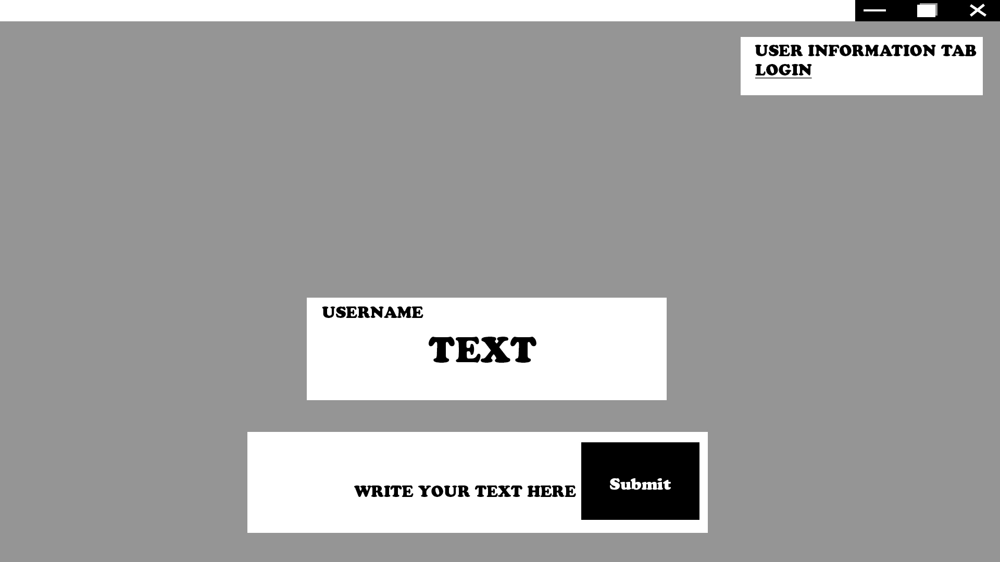
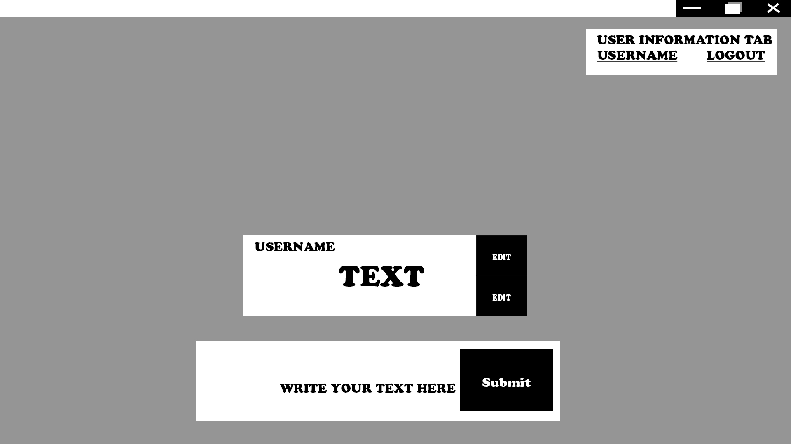
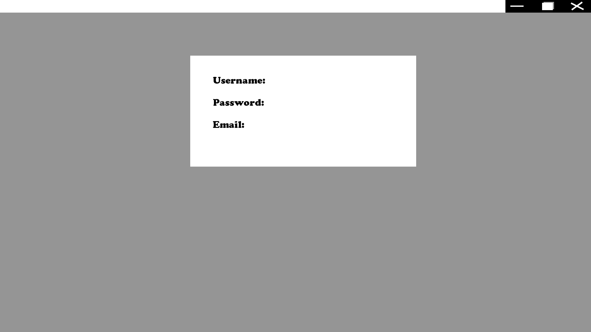
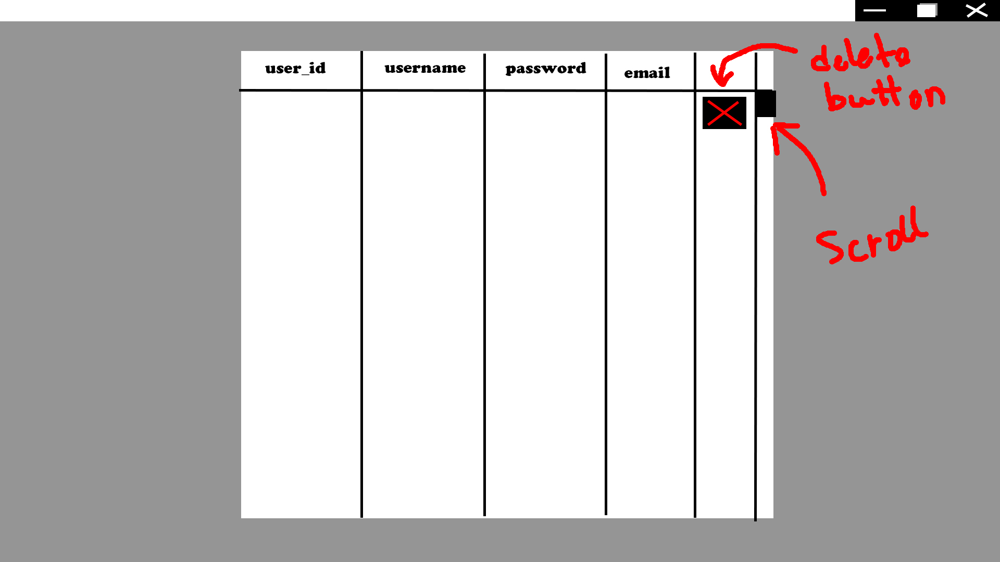
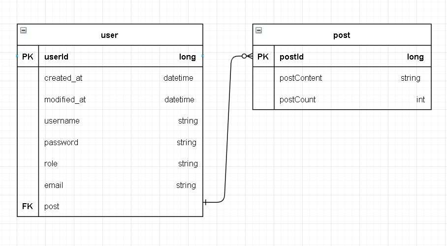

# InfraStructure
- Blog/Guides : https://www.notion.so/InfraStructure-project-7bb46d48d6e84cbaaa989db6f7d28183

# Tech Stack
- Planning:
  - Wireframe: Adobe CS6
  - Database Relations table: draw.io
- Develop Environment: Jdk 1.8.0_301-b09
- Framework: Spring-boot 2.5.4
  - Dependencies: Spring Security, Spring Jpa, Spring H2, Spring Web, Lombok, mySql, Spring Validation, JUnit5 (Jupiter API/Engine : 5.8.0-RC1)
  - Plug-in/Add-on: Yaml Editor 1.8.0

# Project introduction
- This project isn't unique, it's going to be a simple project that has an User entity with user information in datatbase.
- A CRUD mechanism with one to many database structure
- Basic Client to Server communication using Spring MVC Restful API
- Using Amazon web services for deployments
- (Will be added in the future if anything comes to mind)

# Goal/Aim
- Understanding Spring - boot and out of the box framework and tools
- Understanding back-end project structure
- Understanding database transaction
- Understanding Client to Server communications
- Understanding the concept of engaging steps in order to build a website
- Understanding Infrastructure settings / Amazon services / CI, CD / Automatic Deployments
- Understanding Testing
- Understanding everything that is needed in order to become a web developer
- Will be done in 2 weeks

# Wireframe
- Home page (Unlogged)

- Home page (logged)

- User page

- ADMIN page

# API table
| NAME      | METHOD   |   REQUEST | RESPONSE | BODY | DESCRIPTION   |
| ---------- | ---------- |---------- |---------- |---------- | ---------- |
| create user | POST | /api/user | Success: 200 Bad: 400 | { username   password   email }   | |
| get user | GET | /api/user | Success: 200 Bad: 404 / 400 | | dependant on existing users |
| edit user | PUT | /api/user | Success: 200 Bad: 400 | { password }   { email }   ||
| delete user | DELETE | /api/user | Success: 200 Bad: 500 | { userId }   or   { username } | dependant if its a User or Admin |
| create post| POST | /api/createPost | Success: 200 | { userId   postId   postContent   postCount }| |
| get post | GET | /api/getPost | Success: 200 Bad: 404 / 400  | | dependant on existing users |
| edit post | PUT | /api/editPost | Success: 200 Bad: 400 | { userId   postId } | |
| delete post | DELETE | /api/deletePost | Success: 200 Bad: 400 | { userId   postId } | dependant if its a User or Admin |

# Database Relations

## Timeline
| DATE      | PROCEDURE LOG                                                |
| ---------- | ------------------------------------------------------------ |
| 2021.08.20 | 1. Planned project   2. Drew wireframe but since this project is going to be a static website I don't have time to make static webpages. Static webpages to be developed after finishing main back-end goals   3. Planned out API table   4. Drew Database relations   5. pushed Spring project |
| 2021.08.21 | 1. Filled out Tech stack in readMe   2. implemented Validation, JDBC dependencies   3. Created Controller, Repository, SecurityConfiguration for h2 database testing   2. implemented JUnit Jupiter API and Engine for testing purposes |
